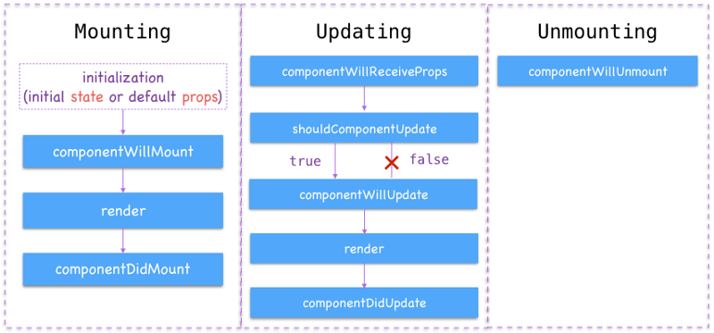
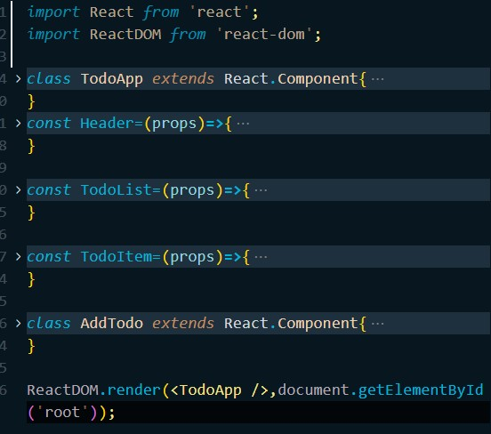

# INTRODUCTION REACT
Bu repo React JS için farklı kullanım senaryolarını içermektedir.
Toplam 5 senaryo 5 branch olarak aktarılmıştır.
1. React Hello World
2. React Hello World JSX (Babel Entegrasyonlu)
3. React Class Component (Todo App)
4. React Class Component + Webpack (Todo App)
5. React Function Component + Hooks (Todo App)

`NOT:` 1,2 ve 3.kısımlarda React direkt olarak HTML sayfasına link olarak eklenmiştir. Yani herhangi bir modül kullanımı yapılmamıştır. Eğer modül (import/export) kullanımı yapmak istiyorsanız "webpack" gibi module bundler aracı kullanmanız gerekmektedir.

## React Class Component 
* Kendi içerisinde state bilgisi tutabilir. State bilgisi tutan componentler için `stateful` component denilmektedir.

## React Function Component
* State bilgisi tutmayan bileşenler function component olarak bildirilebilir. Bu durumda `stateless` component olarak adlandırılır.

## React Function Component + Hooks
* Class Component tarafından sağlanan avantajları (state bilgisi tutma gibi) React Hookları kullanarak sağlayabiliyoruz. Yani class component kullanımına gerek kalmıyor.
* Bir Function Component için state bilgisi tutabilme özelliğini kazandırmak için `useState` hook'u kullanılmaktadır.

# Ortamın Kurulması
Dosyaların indirilmesi
`npm i`

Projeyi Çalıştırma
`npm run start`

`NOT:` Burada yapılanlar işin temelini ifade etmektedir. Yoksa `create-react-app` ile proje oluşturmak daha mantıklı bir yaklaşımdır.

# Class Component vs Function Component

Aşağıda bir `Class Component` ve `Function Component` kullanımı bulunmaktadır.
```js
class TodoApp extends React.Component{
    render(){
        return(
            <div>
                <Header title="Todo Application" description="Lorem, ipsum dolor."/>
            </div>
        );
    }
}
const Header=function(props){
    return(
        <div>
            <h1>{props.title}</h1>
            <div>{props.description}</div>
        </div>
    );
}
```
Yukarıdaki `Function Component` olarak tanımlanan `Header` componenti için `Class Component` tanımlaması aşağıdaki gibi yapılabilir.

```js
class Header extends React.Component{
    render(){
        return(
            <div>
                <h1>{this.props.title}</h1>
                <div>{this.props.description}</div>
            </div>
        );
    }   
}
```
Görüldüğü üzere `Class Component` tanımlamasında `props` zaten içerisinde tanımlı olarak gelmektedir.

`NOT:` State bilgisi içermeyen sadece veri gösterimi için kullanılan bileşenler için stateless function component kullanmak daha mantıklı bir yaklaşımdır.

# React Lifecycle

Temelde bir bileşen için yaşam döngüsünde dört adım bulunmaktadır.
1. Bileşenin Oluşturulması (Initialization)
2. Bileşenin DOM'a bağlanması (Mounting)
3. Bileşenin DOM üzerinde güncellenmesi (Updating)
4. Bileşenin DOM üzerinden kaldırılması (Unmounting)

Yukarıdaki adımlar sonucunda tetiklenen bazı olaylar vardır.
`NOT`: Constructor metodu en başta çalışır

1. `ComponentWillMount`: Bileşenin Real DOM'a aktarılmadan (render) önce tetiklenir.
2. `ComponentDidMount`: Bileşen Real DOM'a eklendikten (render) sonra çalışır.

`Constructor > ComponentWillMount > Render > ComponentDidMount`

`NOT:` Eğer bileşenin bir child bileşeni varsa ve aynı eventlara sahipse çalışma sıraları aşağıdaki gibi olur.

`Constructor > ComponentWillMount > Render > Child Constructor > Child ComponentWillMount > Child Render > Child ComponentDidMount > ComponentDidMount`

3. `ComponentWillUpdate`: Bileşen güncellenmede hemen önce çalışacaktır. Parametre olarakta "nextProps" ve "nextStates" değerlerini alır.

`ComponentWillUpdate > Render`

`NOT:` Props veya state değiştiği anda bileşenin baştan render edilip edilmemesi gerektiğini manuel olarak belirleyebiliyoruz. Bunun için `ShouldComponentUpdate` olayı kullanılır. Geriye bir boolean değer döndürür varsayılan olarak `true` döndürür. Bu değeri `false` yaparsak bileşen `props` ve `state` değişiminde tekrar render edilmez.

4. `ComponentDidUpdate`: Bileşen güncellendikten yani render edildikten sonra çalışır.

`ComponentWillUpdate > Render > ComponentDidUpdate`

5. `ComponentWillUnmount`: Bileşen DOM üzerinden kaldırılmadan önce çalıştırılır.

# Webpack Entegrasyonu
Daha önce `app.js` şeklinde tek dosya üzerinden işlem yapıyorduk ve `React` direkt olarak `HTML` sayfasına eklenmiş durumdaydı. Artık parçalı dosyalar oluşturarak export/import anahtar kelimeleri ile birbirine bağlayacağız.

React kurulumunu HTML sayfasına eklediğimiz linkler ile değil `NPM` aracılığıyla `node_modules` üzerinden dahil edeceğiz. Zaten genel kullanımda bu şekildedir.

Aşağıdaki komut ile projemize webpack paketini dahil ediyoruz. Geliştirme ortamında ihtiyacımız olduğu için `--save-dev` bayrağını kullandık.

`NOT:` Eğer projeyi clone yaptıysanız aşağıdaki yükleme işlemlerini tek tek yapmanız gerekmiyor. Sadece `npm i` komutunu çalıştırmanız yeterli olacaktır.

Öncelikle `webpack` paketini development dependency olarak yüklüyoruz.

```npm
npm i webpack --save-dev
```

Ayrıca webpack komutlarını içeren CLI kurulumunu da yapmamız gerekmektedir.

```npm
npm i webpack-cli --save-dev
```

Kurulum işlemini tamamladıktan sonra `webpack.config.js` dosyasını oluşturup aşağıdaki yapılandırmaları yapmamız gerekmektedir.

```js
const path=require('path');

module.exports={
    entry:'./src/index.js',
    output:{
        path:path.resolve(__dirname,'dist'),
        filename:'bundle.js'
    }
}
```

Daha önce babel için oluşturmuş olduğumuz `NPM Script` mantığını webpack için de oluşturmalıyız.

```js
"scripts": {
    "babel": "npx babel src/app.js --out-file=dist/app.js --watch",
    "webpack-dev":"webpack --mode development",
    "webpack-build":"webpack --mode production"
  },
```
Çalıştırmak için `npm run webpack-dev` diyebiliriz. Çalıştırma işleminden sonra `dist` klasörü altında `bundle.js` dosyasının oluşturulmuş olması gerekmektedir.

`NOT:` Yayına alırken `npm run webpack-build` komutu çalıştırılmalıdır. Çünkü bu komut sonrasında `bundle.js` sıkıştırılarak küçültülmektedir.

## Webpack DevServer
Daha önce HTML dosyasını Visual Studio eklentisi olan `Live Server` üzerinde çalıştırıyorduk. Şimdi webpack tarafından sağlanan bir sunucu üzerinde çalıştırmak için yapılandırmaları yapalım.

Öncelikle aşağıdaki gibi paketi yükleyelim.
```npm
npm i webpack-dev-server --save-dev
```

Yükleme işleminden sonra `webpack.config.js` dosyasında tanımlamayı yapmamız gerekmektedir.

```js
const path=require('path');

module.exports={
    entry:'./src/index.js',
    output:{
        path:path.resolve(__dirname,'dist'),
        filename:'bundle.js'
    },
    mode: 'development',
    devServer:{
        static:{
            directory:path.join(__dirname,"dist")
        },
        compress:true,
        port:9000
    }
}
```
Ayrıca NPM Script kısmını güncellememiz gerekmektedir. Webpack DevServer otomatik olarak development mod üzerinden çıktıyı alacaktır. NPM Scriptleri arasından `webpack-dev` scriptini silebiliriz. Projeyi çalıştırmak için artık `npm run start` dememiz yeterli olacaktır.
```js
"scripts": {
    "babel": "npx babel src/app.js --out-file=dist/app.js --watch",
    "webpack-build": "webpack --mode production",
    "start":"webpack-dev-server --open"
  },
```

## React Kütüphanesini Dahil Etme
Daha önce `HTML` üzerine link şeklinde eklediğimiz dosyaları şimdi NPM aracılığıyla `module` yapısında dahil edeceğiz.

HTML dosyasını ana dizinden `dist` klasörü altına taşıyarak `<script>` linklerini kaldırıyoruz. HTML sayfasına dahil ettiğimiz dosya artık `app.js` değil `bundle.js` olacaktır.

`npm i react` ve `npm i react-dom` komutlarını çalıştırarak kütüphaneleri dahil ediyoruz.

Henüz `babel` entegrasyonunu yapmadığımız için `index.js` içerisine aşağıdaki gibi `JSX` kullanmadan bir kod bloğu ekleyelim.

```js
import React from 'react';
import ReactDOM from 'react-dom';

const template=React.createElement('p',{},'hello react');
ReactDOM.render(template,document.getElementById('root'));
```

`npm run start` komutunu çalıştırdığımızda webpack dev server üzerinde react uygulamamız ayağa kalkacaktır.

## Webpack ve Babel Entegrasyonu
`JSX` ile geliştirme yapabilmek için Babel aracına ihtiyaç duyuyorduk. Ayrıca artık `module` kullanımı da yapıyoruz. Her ikisini ortak payda da buluşturmak için `Webpack` ve `Babel` entegrasyonunu sağlamalıyız.

`package.json` içerisinde `npm script` güncellemesi yapsak fena olmaz. Çünkü artık `babel` için tanımladığımız script'e gerek kalmadı.

```js
"scripts": {
    "webpack-build": "webpack --mode production",
    "start": "webpack-dev-server --open"
  },
```

Öncelikle `babel-loader` paketini kurmamız gerekmektedir.

```npm
npm i babel-loader --save-dev
```

Yükleme işleminden sonra `webpack.config.js` dosyasını aşağıdaki gibi güncelleyelim.

```js
const path=require('path');

module.exports={
    entry:'./src/index.js',
    output:{
        path:path.resolve(__dirname,'dist'),
        filename:'bundle.js'
    },
    mode: 'development',
    devServer:{
        static:{
            directory:path.join(__dirname,"dist")
        },
        compress:true,
        port:9000
    },
    module:{
        rules:[
            {
                test:/\.js$/,
                loader:'babel-loader',
                exclude:/node_modules/
            }
        ]
    }
}
```

Yapılandırma işlemi de tamamlandığına göre `index.js` dosyasında bir JSX kullanımı yapalım.

```js
import React from 'react';
import ReactDOM from 'react-dom';

const template=<p>Hello World</p>
ReactDOM.render(template,document.getElementById('root'));
```

`npm run start` komutu ile uygulamayı çalıştıralım.

Hellow World tamamsa daha önce yapmış olduğumuz `Todo App` uygulamasını yani `app.js` dosyasını giriş dosyası olarak `webpack.config.js` dosyasında bildirelim.

```js
const path=require('path');

module.exports={
    entry:'./src/app.js',
    output:{
        path:path.resolve(__dirname,'dist'),
        filename:'bundle.js'
    },
    ...
```

Ayrıca `app.js` dosyasına `import` işlemiyle paketleri dahil edelim.

```js
import React from 'react';
import ReactDOM from 'react-dom';

class TodoApp extends React.Component{

    constructor(props){
        ...
```

`Ctrl+C` ve `y` enter komutlarıyla sunucuyu durdurup `npm run start` ile tekrar başlatalım.

## Component Dosyalarını Oluşturma
Tüm bileşenler tek bir dosyada bunu ayrıştırarak yönetmek daha kolay olacaktır.



Öncelikle `components` klasöründe `Header.js` dosyası oluşturun. Sonrasında kodları `Header.js` içerisine alın. Ayrıca dışarıdan bileşeni kullanabilmek için `export` ile dışarıya açmalısınız.

```js
import React from 'react'

const Header=(props)=>{
    return(
        <div>
            <h1>{props.title}</h1>
            <div>{props.description}</div>
        </div>
    );
}

export default Header;
```

Şimdi `app.js` içerisinde dahil edin.

```js
import React from 'react';
import ReactDOM from 'react-dom';
import Header from './components/Header';
```

Aynı mantıkta diğerleri içinde bu işlemi gerçekleştirmek gerekmektedir. Son hali zaten proje dizininde bulunmaktadır.

## Function Component + Hooks (useState, useEffect)
Aşağıda `useState` hook kullanımıyla `function component` oluşturulmuştur. 

```js
import React,{ useState } from 'react';

function AddTodo({addItem}){
    const [error,setError]=useState('');

    const onFormSubmit=(e)=>{
        e.preventDefault();
        const item=e.target.elements.todoText.value.trim();
        const error=addItem(item);
        setError(error);
        e.target.elements.todoText.value='';
    }
    return(
        <div>
            {error && <p>{error}</p>}
            <form onSubmit={onFormSubmit}>
                <input type="text" name="todoText" />
                <button type="submit">Add Item</button>
            </form>                
        </div>
    );
}

export default AddTodo;
```

`useEffect` lifecycle metodlarını function component içerisinde kullanmayı sağlar. Bunu da dependency array ile gerçekleştirebiliriz. Eğer array boş ise `componentDidMount()` ve `componentDidUpdate()` metodunu taklit etmiş olur. Eğer array içerisinde tanımlı state değerleri varsa sadece onlar değiştiğinde tetiklenir.

```js
useEffect(() => {
      //componentDidMount()
      const json=localStorage.getItem('items');
      const items=JSON.parse(json);

      if(items){          
          setItems([...items])
      }
    }, [])

    useEffect(() => {
        //componentDidUpdate()      
        const json=JSON.stringify(items);
        localStorage.setItem('items',json);
    }, [items])
```

`componentWillUnmount()` return içerisinde yapılacaklar bildirilir.

```js
useEffect(() => {
      first
      return () => {
       //componentWillUnmount() taklit edilir
       second
      }
    }, [third])
```