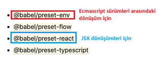

# INTRODUCTION REACT
Bu repo React JS için farklı kullanım senaryolarını içermektedir.
Toplam 5 senaryo 5 branch olarak aktarılmıştır.
1. React Hello World
2. React Hello World JSX (Babel Entegrasyonlu)
3. React Class Component (Todo App)
4. React Class Component + Webpack (Todo App)
5. React Function Component + Hooks (Todo App)

`NOT:` 1,2 ve 3.kısımlarda React direkt olarak HTML sayfasına link olarak eklenmiştir. Yani herhangi bir modül kullanımı yapılmamıştır. Eğer modül (import/export) kullanımı yapmak istiyorsanız "webpack" gibi module bundler aracı kullanmanız gerekmektedir.

## React Class Component 
* Kendi içerisinde state bilgisi tutabilir. State bilgisi tutan componentler için `stateful` component denilmektedir.

## React Function Component
* State bilgisi tutmayan bileşenler function component olarak bildirilebilir. Bu durumda `stateless` component olarak adlandırılır.

## React Function Component + Hooks
* Class Component tarafından sağlanan avantajları (state bilgisi tutma gibi) React Hookları kullanarak sağlayabiliyoruz. Yani class component kullanımına gerek kalmıyor.
* Bir Function Component için state bilgisi tutabilme özelliğini kazandırmak için `useState` hook'u kullanılmaktadır.

# React Hello World JSX
Javascript XML olarak açabileceğimiz JSX, React uygulaması geliştirirken büyük kolaylık sağlamaktadır. HTML etiketlerini JS dosyalarında doğrudan kullanabileceğimiz bir yapı sağlamaktadır. Tabi ufak tefek farklılıkları bulunmaktadır.

Örneğin;
```html
<div class="box">
</div>
```
şeklinde bildirmiş olduğumuz bir HTML bileşeninde `class` özniteliği hataya sebep olacaktır. Çünkü JSX sözdiziminde `class` değil `className` kullanılmaktadır. Bu gibi ufak detayları console penceresindeki hatalardan bile görebilirsiniz. Tabii ufak bir google araştırması yapmanız da faydalı olacaktır.

Bu reponun amacı JSX nedir sorusuna cevap vermek ve `Babel` yapılandırmasını tamamlamaktır.

Javascript tarafındaki ES6+ sürümlere ait özelliklerin ES5 formatına dönüştürülmesi ve React JSX söz diziminin dönüştürülmesi için `Babel` aracından faydalanacağız.

`NOT:` Eğer repoyu `clone` yaptıysanız aşağıdaki adımları tek tek yapmak zorunda değilsiniz. `npm i` komutunu çalıştırmanız yeterli olacaktır.

## Ortamın Kurulması


Yukarıda Babel tarafından sağlanan presetsler bulunmaktadır. Bunlardan bizim için gerekli olan `@babel/preset-env` ve `@babel/preset-react` paketleridir.

```npm
npm install --save-dev @babel/preset-env
```
```npm
npm install --save-dev @babel/preset-react
```

Komutlarını ana dizinde çalıştırıyoruz. Geliştirme ortamında ihtiyacımız olan bu iki paketi yüklediğimize göre yine geliştirme ortamında ihtiyaç duyduğumuz Babel komutlarını yürütebileceğimiz `@babel/core` ve `@babel/cli` paketlerini yükleyebiliriz.

```npm
npm install --save-dev @babel/core
```
```npm
npm install --save-dev @babel/cli
```

Yükleme işlemlerini tamamladığımıza göre `NPM Script` ile çalıştırılabilir hale getirebiliriz.

Öncelikle `.babelrc` dosyasını oluşturmamız gerekmektedir. Burada `NPM Script` ile çalıştıracağımız komuta yapılandırma vermiş olacağız.

```js
{
    "presets":["@babel/preset-env","@babel/preset-react"]
}
```

Şimdi `package.json` dosyasında script tanımını aşağıdaki gibi yapıyoruz.
```js
"scripts": {
    "babel": "npx babel src/app.js --out-file=dist/app.js --watch"
  },
```
Yukarıdaki script `src` klasöründe app.js dosyasını arar ve `dist` klasörü altına dönüşümlerden geçirdikten sonra çıkartır.

Çalıştırmak için `npm run babel` demeniz yeterli olacaktır. Ayrıca --watch bayrağı sayesinde src/app.js içerisinde değişiklik olduğunda otomatik olarak tekrar çıktı verecektir. Tabii ilgili console penceresini kapatmadığınız sürece bu geçerlidir.

HTML dosyasında da dahil ederken `dist` klasörünü bildirmeyi unutmayın.

```html
<script src="dist/app.js"></script>
```

Aşağıdaki kod bir önceki branch üzerinde tanımlı olan koddur.

```js

var root=document.getElementById('root');
var template=React.createElement(
    'h1',
    null,
    'Hello World'
);
ReactDOM.render(template,root);
```

Burada ufak bir dönüşüm yapıyoruz. Yani JSX kullanıyoruz.

```js
var root=document.getElementById('root');
var template=<h1>Hello World</h1>
ReactDOM.render(template,root);
```

Görüldüğü üzere oldukça basit bir görünüm kazandı.